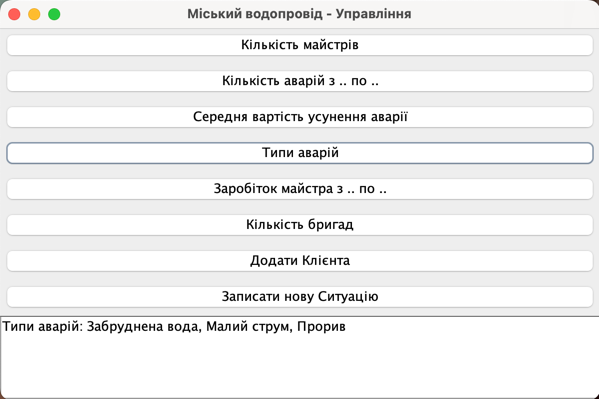

# Курсова робота з OOP-Java

## 1. Загальні положення

   Метою курсової роботи є поглиблення та закріплення знань, одержаних
   при вивченні дисципліни „Об’єктно-орієнтоване програмування”, та набуття
   практичних навичок у проектуванні та налагодженні програм, що застосовують
   класи та об’єкти.

   Студент має розробити консольне застосування для роботи зі списками
   об'єктів. Інформація для списків може зберігатися в файлах. Кожен зі списків
   повинен містити не менше 3 об'єктів класу.

   Структура сутностей приведена в описі кожного індивідуального завдання.
   Студент може додавати в клас якості, але їх не може бути менше, ніж зазначено
   в завданні. Також студент може вводити додаткові класи.

   Застосування повинне обробляти не менше шести запитів.

   Для реалізації успадкування в роботі повинен використовуватися
   абстрактний клас і породжені від нього класи (не менше двох). Для реалізації
   композиції повинні бути створені класи, які не входять в ієрархію і являють
   собою деякі властивості (як мінімум один клас). Бажано деякі властивості
   реалізувати статичними даними.

   Вхідні дані потрібно перевіряти на відповідність встановленим типам і
   діапазонам значень.

   В роботі треба навести опис і реалізацію інтерфейсу користувача.

   Розроблена програма має забезпечити виконання, як мінімум 6 запитів
   наведених у кожному індивідуальному завданні.

## 2. Зміст та порядок виконання курсової роботи
   Етапи виконання курсової роботи

    1. Постановка задачі. 
        1.1 Уточнення вимог до програмного продукту.
        1.2 Об’єктно-орієнтований аналіз, визначення об’єктів і класів.
        1.3 Визначення даних і методів.
        1.4 Визначення інтерфейсів.
    2. Проектування класів та написання коду.
        2.1 Проектування класів.
        2.2 Написання коду класів у середовищі програмування.
        2.3 Застосування колекцій.
    3. Створення інтерфейсу користувача та файлів даних.
       3.1 Створення графічних елементів керування.
       3.2 Створення засобів обробки подій.
       3.3 Створення файлів даних.
    4. Перевірка функціонування програмного продукту.


Запити до системи:

    1. Кількість майстрів.
    2. Кількість аварій з.. по…
    3. Середня вартість усунення аварії.
    4. Типи аварій.
    5. Заробіток майстра з … по….
    6. Кількість бригад.


**З таким вмістом в Main:**
```java
import java.util.ArrayList;
import java.util.List;

public class Main {
   public static void main(String[] args) {
      // Створення кількох робітників
      Master master1 = new Master("Іван Петренко", "вул. Шевченка 1", "+380991234567", 1, 5, 1, 15000.0,  "Вільний");
      Master master2 = new Master("Петро Іваненко", "вул. Франка 2", "+380997654321", 1, 3, 1, 12000.0,  "Зайнятий");
      Master master3 = new Master("Олена Коваленко", "вул. Лесі Українки 3", "+380993456789", 2, 7, 2, 18000.0, "Вихідний");

      // Створення бригад
      List<Master> brigade1Masters = new ArrayList<>();
      brigade1Masters.add(master1);
      brigade1Masters.add(master2);
      Brigade brigade1 = new Brigade(1, brigade1Masters);

      List<Master> brigade2Masters = new ArrayList<>();
      brigade2Masters.add(master3);
      Brigade brigade2 = new Brigade(2, brigade2Masters);

      // Створення аварій
      Accident accident1 = new Accident("Прорив труби", "2024-03-15", 5000.0, "ACC001", "вул. Шевченка 1", "В процесі");
      Accident accident2 = new Accident("Малий струм води", "2024-03-16", 3000.0, "ACC002", "вул. Шевченка 2", "Завершено");
      Accident accident3 = new Accident("Забруднена вода", "2024-03-17", 800.0, "ACC003", "вул. Шевченка 3","Очікує розгляду");

      // Виведення інформації
      System.out.println("Інформація про бригади:");
      System.out.println(brigade1);
      System.out.println(brigade2);

      System.out.println("\nІнформація про аварії:");
      System.out.println(accident1);
      System.out.println(accident2);
      System.out.println(accident3);

      System.out.println("\nКількість майстрів у бригаді 1: " + brigade1.getMastersCount());
      System.out.println("Кількість майстрів у бригаді 2: " + brigade2.getMastersCount());

      // Додавання аварій у список
      List<Accident> accidents = new ArrayList<>();
      accidents.add(accident1);
      accidents.add(accident2);
      accidents.add(accident3);

      // Виклик методу для підрахунку кількості аварій
      int accidentCount = countAccidents(accidents);
      System.out.println("Кількість аварій: " + accidentCount);
   }
   public static int countAccidents(List<Accident> accidents) {
      return accidents.size();
   }
}

```

**Результат:**

